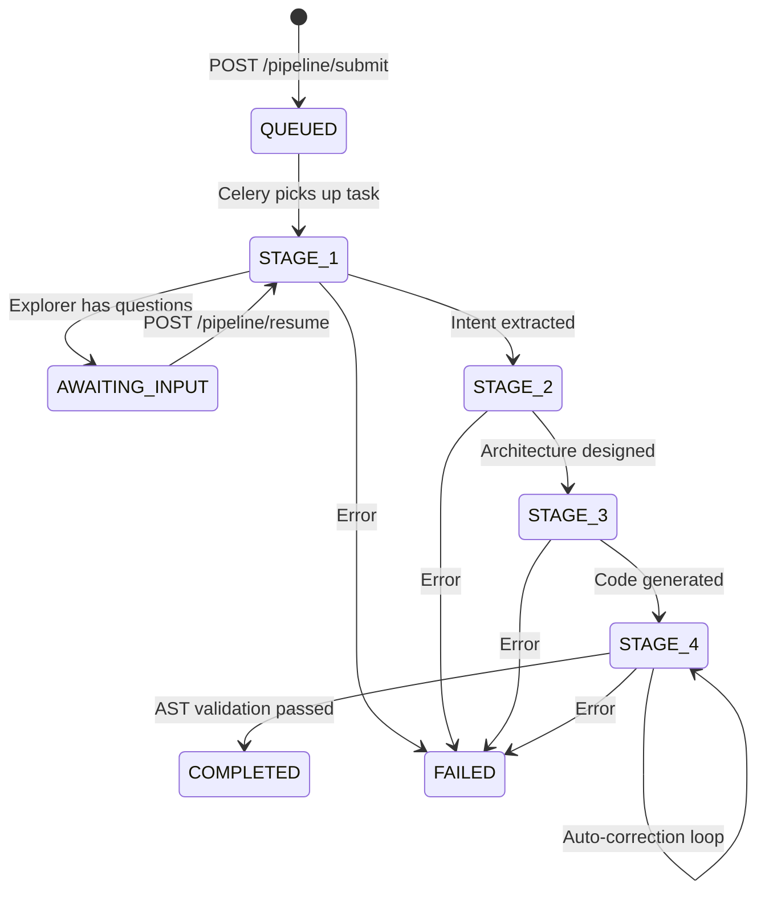

<div align="center">

<br/>


# ⚡ FORGE — Autonomous Agentic Dev Studio

### *From a single sentence to a validated FastAPI backend. Zero boilerplate. Zero scaffolding.*

<br/>

[](https://forge-dev-black.vercel.app/)
[]()

<br/>


</div>

<br/>

---

<br/>

## 🎯 The Problem

Every backend project starts the same way — hours lost to scaffolding `models.py`, writing CRUD boilerplate, configuring auth, wiring routes to `main.py`, and praying the imports resolve. FORGE eliminates all of it.

**Describe your backend in one sentence. FORGE's autonomous agent pipeline handles the rest:**

```
"Build me a task management API with team workspaces and role-based permissions"
```

↓ *4 AI agents collaborate* ↓

```
✅  14 validated Python files  •  TRD  •  Architecture Map  •  Review Report  •  README
```

<br/>

---

<br/>

## 🧠 The Agentic Edge — 4-Agent Autonomous Pipeline

FORGE isn't a code template or a snippet generator. It's a **state machine** powered by four specialised AI agents that collaborate sequentially — each agent's output becomes the next agent's input. The pipeline supports **pausing, human interaction, and autonomous resumption**.

<br/>



<br/>

### Agent Breakdown

| Stage | Agent | What It Does | Key Mechanism |
|:-----:|:-----:|:-------------|:--------------|
| **01** | **🔍 Explorer** | Extracts project intent through targeted questioning. Returns hybrid questions (4 quick-select options + freeform) or extracts intent directly. Forces extraction after `MAX_ROUNDS`. | Conversational HITL with structured JSONB persistence |
| **02** | **📐 Architect** | Converts extracted intent → Technical Requirements Document (TRD) + complete file tree with dependency ordering. Validates schema before proceeding. | Schema validation via `validate_trd()` / `validate_arch()` |
| **03** | **💻 Developer** | Generates every source file in dependency order with rate-limit-aware delays. Each file is AST-validated inline — failures trigger retry with error context injection. | Atomic write — no partial output hits disk |
| **04** | **🔬 Reviewer** | Runs a **dual-layer validation**: Layer 1 = 7 deterministic AST checks. Layer 2 = LLM semantic review (security, correctness, completeness). Critical issues trigger an **auto-correction loop**. | `ast.parse()` + LLM review + autonomous regeneration |

<br/>

### The 7 Deterministic AST Checks (Layer 1)

The Reviewer doesn't just "read" the code — it structurally validates every generated Python file:

| # | Check | What It Catches |
|:-:|:------|:----------------|
| 1 | **Import Resolution** | `from x import y` where `x.py` doesn't exist in the file tree |
| 2 | **Package Prefix Ban** | Package-prefixed imports like `from myproject.models import ...` — flat imports only |
| 3 | **Base Model Import** | `models.py` must import `Base` from `database` |
| 4 | **SessionLocal Hint** | `SessionLocal` used as type hint instead of `Session` from `sqlalchemy.orm` |
| 5 | **Direct `get_db()` Calls** | `get_db()` called directly instead of via `Depends(get_db)` |
| 6 | **Router Mounting** | All `*_routes.py` files must be imported and mounted in `main.py` |
| 7 | **Depends Scope** | `Depends()` used outside route handlers or known dependency functions |

<br/>

### Auto-Correction Loop

When the Reviewer finds critical issues, FORGE doesn't just report them — it **fixes them autonomously**:

```
Reviewer detects critical issue in routes.py
  → Injects error context into Developer agent prompt
  → Regenerates file with fix instructions
  → Re-validates via ast.parse()
  → Re-runs all 7 Layer 1 checks
  → Accepts or rejects the correction
```

This closed-loop system ensures every artifact that leaves the pipeline is **syntactically valid Python** — guaranteed by `ast.parse()`, not by hope.

<br/>

---

<br/>

## 🖥️ Modern UX — Refined & Context-Aware

The frontend is built with **React 19 + Vite 8 + TailwindCSS** and deployed to Vercel with SPA rewrites.

<br/>

### UI Architecture

| View | Purpose |
|:-----|:--------|
| **Landing** | Animated hero with feature showcase and CTA |
| **Dashboard** | Real-time pipeline monitoring with status cards, progress bars, and execution history |
| **New Run** | Guided project submission with step indicators and environment hints |
| **Pipeline Run** | Live stage timeline, execution log with colour-coded entries (`[AGENT]`, `[PAUSE]`, `[SUCCESS]`), and inline Question Form for HITL |
| **Artifacts Explorer** | IDE-style file tree + syntax-highlighted code viewer with copy-to-clipboard and bulk download |

<br/>

### Recent UX Refinements

**Streamlined Sidebar** — The context panel was surgically refined to surface only the core navigation: **Overview** and **Flow Editor**. Out-of-scope modules (Environment, Training, Deployment) were deprecated to keep the interface focused on FORGE's core strength: the autonomous pipeline.

**Initial Prompt Persistence** — Every completed pipeline now displays a branded **"Initial Prompt"** card (with `auto_awesome` icon) at the top of the Artifacts view. This gives users instant traceability — connecting the AI's generated output directly back to their original natural-language requirements. No more context-switching to remember *what* you asked for.

**Human-in-the-Loop UX** — When the Explorer Agent needs clarification, the pipeline pauses gracefully. The frontend renders interactive **Quick-Select** buttons (4 industry-standard options per question) plus a freeform textarea, letting users answer with a single click or type a custom response. Answers are persisted as structured JSONB and the pipeline resumes automatically.

<br/>

---

<br/>

## 🏗️ Monorepo Structure

```
forge-monorepo/
├── agentic-dev-studio/              # Backend — FastAPI + Celery + AI Agents
│   ├── agents/
│   │   ├── explorer.py              # Conversational intent extraction + HITL
│   │   ├── architect.py             # TRD → Architecture + file tree design
│   │   ├── developer.py             # File-by-file code generation
│   │   └── reviewer.py              # LLM semantic review (Layer 2)
│   ├── pipeline/
│   │   └── orchestrator.py          # State machine — stage routing, halt/resume
│   ├── utils/
│   │   ├── ast_checker.py           # 7 deterministic validation checks (Layer 1)
│   │   ├── ast_validator.py         # Python AST parse validation
│   │   ├── auto_corrector.py        # Autonomous fix loop for critical issues
│   │   ├── llm_client.py            # Multi-key rotation + rate limit handling
│   │   ├── trd_builder.py           # TRD document generator
│   │   ├── arch_builder.py          # Architecture document generator
│   │   └── review_builder.py        # REVIEW_REPORT.md generator
│   ├── api/
│   │   ├── routers/projects.py      # Pipeline submit, resume, status, results
│   │   ├── worker/                  # Celery app + async task definitions
│   │   └── config.py               # Pydantic settings
│   ├── docker-compose.yml           # Production config (memory-limited)
│   ├── docker-compose.override.yml  # Dev overrides (bind mounts, hot-reload)
│   └── Dockerfile.api               # Multi-service container image
│
└── forge-v3/                        # Frontend — React 19 + Vite 8 + TailwindCSS
    ├── src/
    │   ├── pages/
    │   │   ├── Dashboard.tsx        # Pipeline monitoring + execution history
    │   │   ├── RunView.tsx          # Live stage timeline + question form
    │   │   ├── Artifacts.tsx        # IDE-style file explorer + prompt card
    │   │   ├── NewRun.tsx           # Guided project submission
    │   │   └── Landing.tsx          # Animated hero + feature showcase
    │   ├── components/
    │   │   ├── layout/AppShell.tsx   # Icon rail + collapsible context panel
    │   │   ├── pipeline/            # StageIndicator, QuestionForm
    │   │   └── artifacts/           # FileTree, CodeViewer
    │   ├── api/pipeline.ts          # Typed API client (submit, resume, status)
    │   └── types/pipeline.ts        # TypeScript state machine types
    ├── vercel.json                   # SPA rewrite rules
    └── package.json
```

<br/>

---

<br/>

## 🔬 Technical Differentiators

### Fault-Tolerant LLM Failover
The system loads up to 5 API keys (`GROQ_API_KEY`, `_2`, `_3`…) and **automatically rotates on `RateLimitError`**. Long-running agentic tasks survive individual key exhaustion without pipeline failure. Additionally, a `_call_with_rate_limit_retry` wrapper implements progressive backoff (30s → 45s → 60s) per key.

### Atomic File Generation
No partial outputs. The Developer agent generates all files into an in-memory `file_buffer` — each individually AST-validated — and only writes to disk via `write_generated_files()` after *every* file passes. If any file fails after max retries, the entire output is cleaned up.

### Conversation Persistence
All Explorer interactions are persisted as structured JSONB in Supabase's `conversation_history` column. The `_flatten_history_item()` helper safely serializes complex Q&A dicts into LLM-consumable strings, preventing `TypeError` on resume across Celery worker restarts.

### Automatic Schema Migration
On startup, both the FastAPI lifespan hook and the Celery `worker_ready` signal probe the `pipeline_runs` table for required state-machine columns. Missing columns trigger auto-migration via Supabase RPC or surface a human-readable SQL snippet.

### Deterministic Intent Correction
After the Explorer extracts intent, `apply_deterministic_corrections()` scans features for auth signals (`login`, `account`, `role`, `permission`) and forces `needs_auth: true` — ensuring the Architect never misses authentication requirements regardless of LLM output.

<br/>

---

<br/>

## 🚀 Quick Start

### Prerequisites

| Requirement | Version |
|:------------|:--------|
| Docker & Docker Compose | Latest |
| Node.js | 18+ |
| Supabase Project | [supabase.com](https://supabase.com) |
| Groq API Key(s) | [console.groq.com](https://console.groq.com) |

### 1. Clone & Configure

```bash
git clone https://github.com/SurajD45/FORGE-Dev.git
cd forge-monorepo/agentic-dev-studio

cp .env.example .env
# → Fill in SUPABASE_URL, SUPABASE_ANON_KEY, SUPABASE_SERVICE_ROLE_KEY, GROQ_API_KEY
```

### 2. Database Migration

Run in the Supabase SQL Editor:

```sql
ALTER TABLE pipeline_runs
  ADD COLUMN IF NOT EXISTS project_idea TEXT,
  ADD COLUMN IF NOT EXISTS conversation_history JSONB DEFAULT '[]'::jsonb,
  ADD COLUMN IF NOT EXISTS explorer_questions JSONB,
  ADD COLUMN IF NOT EXISTS current_round INTEGER DEFAULT 0;
```

### 3. Start Backend (Docker Compose)

```bash
# Development (with hot-reload via override)
docker-compose up --build -d

# Production (EC2) — remove docker-compose.override.yml first
docker-compose up --build -d
```

### 4. Start Frontend

```bash
cd ../forge-v3
npm install
npm run dev          # → http://localhost:5173
npm run build        # → Production bundle for Vercel
```

### 5. Verify

| Service | URL |
|:--------|:----|
| API Docs (Swagger) | `http://localhost:8001/docs` |
| Frontend (Dev) | `http://localhost:5173` |
| Frontend (Prod) | [forge-dev-black.vercel.app](https://forge-dev-black.vercel.app/) |

<br/>

---

<br/>

## 📡 API Reference

| Method | Endpoint | Description |
|:------:|:---------|:------------|
| `POST` | `/pipeline/submit` | Submit a project idea → returns `pipeline_id` |
| `GET` | `/pipeline/status/{id}` | Poll status, current stage, and `explorer_questions` |
| `POST` | `/pipeline/resume` | Submit answers to resume a halted pipeline |
| `GET` | `/pipeline/result/{id}` | Fetch artifacts with download URLs after completion |
| `GET` | `/pipeline/runs` | List all pipeline runs for the authenticated user |
| `POST` | `/auth/register` | Register via Supabase Auth |
| `POST` | `/auth/login` | Login → JWT token |

<br/>

---

<br/>

## ☁️ Production Deployment

### Backend — AWS EC2 + Nginx Reverse Proxy

The backend runs on an **AWS EC2 t3.micro** (1 vCPU / 1 GB RAM) behind an **Nginx reverse proxy with SSL termination**. Docker Compose enforces strict memory limits to prevent OOM kills on the constrained instance.

| Service | Container | Memory Limit | Restart Policy |
|:--------|:----------|:------------:|:--------------:|
| FastAPI API | `forge-api` | 300 MB | `always` |
| Celery Worker | `forge-worker` | 350 MB | `always` |
| Redis Broker | `forge-redis` | 64 MB | `always` |

**Production architecture:**

```
Client → Nginx (SSL/443) → Reverse Proxy → forge-api (:8000)
                                          → forge-worker → Redis (:6379)
                                          → Supabase (PostgreSQL)
```

> **Tip:** Configure 2 GB swap on the t3.micro to handle peak LLM response parsing. All services use an isolated `forge-network` bridge with Google DNS (`8.8.8.8`) for reliable external API access.

```bash
# On EC2
ssh ec2-user@your-instance
cd forge-monorepo/agentic-dev-studio
docker-compose up --build -d
docker stats --no-stream   # Verify memory usage
```

### Frontend — Vercel

The `forge-v3/` directory deploys directly to Vercel with SPA rewrites configured in `vercel.json`. Set the environment variable:

```
VITE_API_BASE_URL=https://your-domain.com
```

<br/>

---

<br/>

## 🔧 Environment Variables

| Variable | Required | Description |
|:---------|:--------:|:------------|
| `SUPABASE_URL` | ✅ | Supabase project URL |
| `SUPABASE_ANON_KEY` | ✅ | Supabase anonymous (public) key |
| `SUPABASE_SERVICE_ROLE_KEY` | ✅ | Service role key for RPC migrations |
| `REDIS_URL` | ✅ | `redis://redis:6379/0` (Docker) or external URL |
| `GROQ_API_KEY` | ✅ | Primary Groq API key |
| `GROQ_API_KEY_2` … `_5` | ○ | Additional keys for failover rotation |
| `AUTO_MIGRATE_DB` | ○ | `true` to auto-run schema migrations on startup |
| `CREWAI_DISABLE_TELEMETRY` | ○ | `true` to disable CrewAI telemetry |
| `VITE_API_BASE_URL` | ✅ | Backend URL for frontend (Vercel env) |

<br/>

---

<br/>

## 🗺️ Roadmap

| Status | Feature |
|:------:|:--------|
| ✅ | 4-agent autonomous pipeline with HITL |
| ✅ | Dual-layer validation (AST + LLM semantic review) |
| ✅ | Auto-correction loop for critical issues |
| ✅ | Initial Prompt Persistence in Artifacts view |
| ✅ | Streamlined sidebar (Overview + Flow Editor) |
| ✅ | Production deployment: EC2 + Nginx SSL + Vercel |
| 🔄 | Expand **Flow Editor** — visual pipeline orchestration with drag-and-drop stage configuration |
| 🔜 | Multi-language support (Django, Express, Spring Boot) |
| 🔜 | Git integration — push generated projects directly to GitHub |
| 🔜 | Real-time WebSocket log streaming (replace polling) |

<br/>

---

<br/>

<div align="center">

**Built with obsessive engineering by [Suraj Doifode](https://github.com/SurajD45)**

*FORGE doesn't generate boilerplate. It engineers backends.*

<br/>

[](https://forge-dev-black.vercel.app/)

</div>