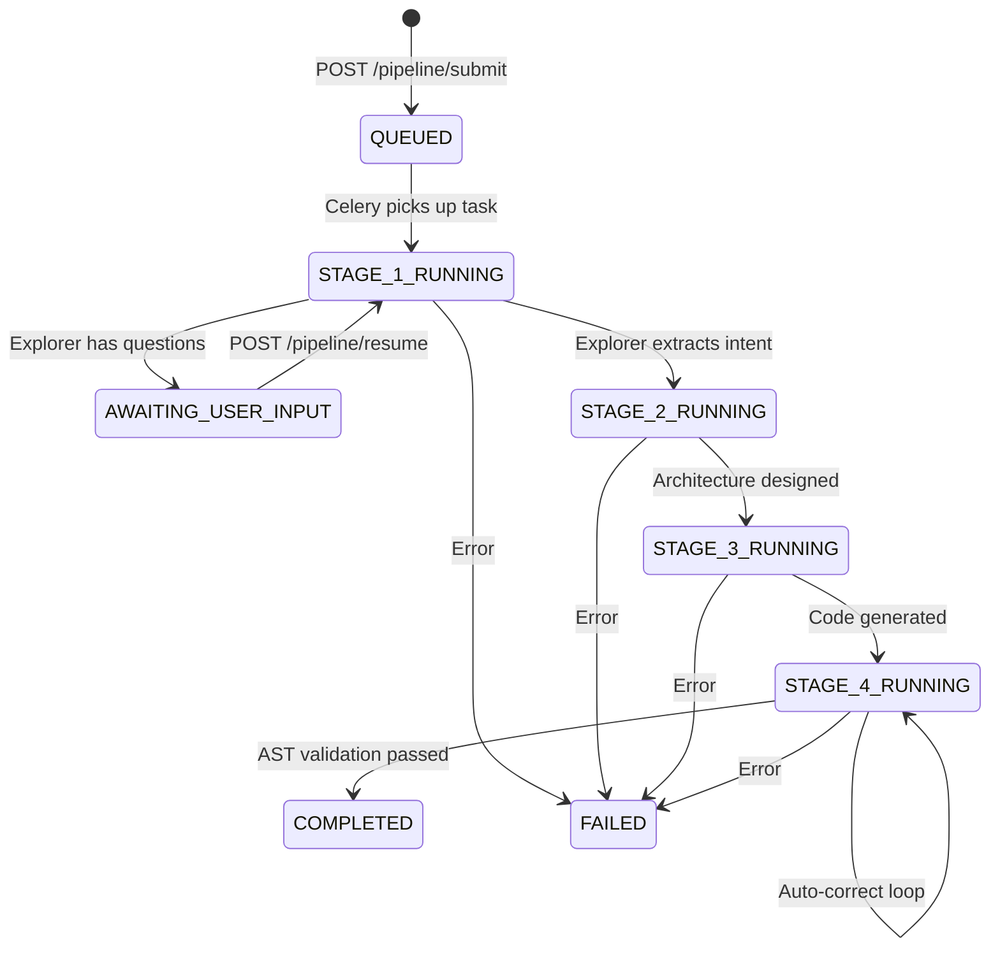

<div align="center">

# 🔥 FORGE — From Prompt to Production Backend

**An autonomous, multi-agent platform that converts a natural-language idea into a fully validated FastAPI backend — with human-in-the-loop refinement.**


</div>

---

## 📖 Overview

FORGE takes a single project idea — *"Build me a task management API with team workspaces"* — and autonomously:

1. **Asks clarifying questions** via a conversational Explorer Agent
2. **Designs** the architecture and file structure
3. **Generates** clean, modular FastAPI source code
4. **Validates** the output using Python AST static analysis and auto-corrects errors

The entire pipeline runs asynchronously via Celery workers, with real-time status updates pushed to a React frontend hosted on Vercel.

---

## 🏗️ Monorepo Structure

```
forge-monorepo/
├── agentic-dev-studio/          # Backend — FastAPI + Celery + Agents
│   ├── agents/                  # LLM agent implementations
│   │   └── explorer.py          # Intent extraction & question generation
│   ├── api/                     # FastAPI application
│   │   ├── routers/projects.py  # Pipeline submit, resume, status, results
│   │   ├── worker/              # Celery app & task definitions
│   │   ├── utils/db_migrator.py # Automatic schema validation on startup
│   │   └── config.py            # Pydantic settings
│   ├── pipeline/
│   │   └── orchestrator.py      # State machine — stage routing & halting
│   ├── utils/                   # AST validator, LLM client, storage
│   ├── migrations/              # SQL migration scripts
│   ├── docker-compose.yml       # Production config (memory-limited)
│   └── docker-compose.override.yml  # Dev overrides (bind mounts)
│
└── forge-v3/                    # Frontend — React 19 + Vite + TailwindCSS
    ├── src/
    │   ├── pages/RunView.tsx    # Real-time pipeline tracking + question form
    │   ├── components/pipeline/ # StageIndicator, QuestionForm
    │   ├── api/pipeline.ts      # API client (submit, resume, status)
    │   └── types/pipeline.ts    # TypeScript types for pipeline states
    └── package.json
```

---

## 🧠 System Architecture

### State Machine Pipeline

FORGE uses a **state machine architecture** that supports pausing, human interaction, and resumption — not a simple linear flow.



### Agent Pipeline

| Stage | Agent | Responsibility |
|-------|-------|----------------|
| **1** | **Explorer** | Conversational intent extraction. Returns `questions` (halt) or `intent` (proceed). Forces extraction after MAX_ROUNDS. |
| **2** | **Architect** | Converts intent → Technical Requirements Document (TRD) + file tree |
| **3** | **Developer** | Generates FastAPI source code from TRD |
| **4** | **Reviewer** | AST validation + auto-correction loop until code is syntactically clean |

### Human-in-the-Loop (HITL) Flow

The Explorer Agent implements a **hybrid question format**:

```json
{
  "type": "questions",
  "content": [
    {
      "question": "What database should be used?",
      "options": ["PostgreSQL", "MongoDB", "SQLite", "Redis"],
      "type": "hybrid"
    }
  ]
}
```

- The pipeline **halts** at Stage 1 with status `awaiting_user_input`
- Questions are stored in `explorer_questions` (JSONB) in Supabase
- The frontend renders clickable **Quick-Select** option buttons + a freeform textarea
- User answers are submitted via `POST /pipeline/resume`, appended to `conversation_history`, and the Celery worker resumes

---

## 🔬 Technical Edge

### Python AST Static Validation
Generated Python code is parsed via `ast.parse()` before being accepted. Syntax errors, undefined structures, and malformed imports are caught **in-memory** and fed back into the agentic loop for auto-correction — guaranteeing syntactically valid output without runtime execution.

### Fault-Tolerant LLM Failover
The system loads multiple API keys (`GROQ_API_KEY`, `GROQ_API_KEY_2`, etc.) and automatically rotates on `RateLimitError`. Long-running agentic tasks survive individual key exhaustion.

### Automatic Schema Validation
On startup, both the FastAPI lifespan hook and the Celery `worker_ready` signal probe the `pipeline_runs` table for required state-machine columns. Missing columns trigger either auto-migration (via RPC) or a human-readable error banner with the exact SQL to run.

### Conversation Persistence
All Explorer interactions are persisted as structured JSONB in Supabase's `conversation_history` column. The `_flatten_history_item()` helper safely serializes complex Q&A dicts into LLM-consumable strings, preventing `TypeError` on resume.

---

## 🚀 Quick Start

### Prerequisites
- Docker & Docker Compose
- Node.js 18+ (for frontend)
- A [Supabase](https://supabase.com) project
- [Groq](https://console.groq.com) API key(s)

### 1. Clone & Configure

```bash
git clone https://github.com/SurajD45/FORGE-Dev.git
cd forge-monorepo/agentic-dev-studio

cp .env.example .env
# Edit .env with your Supabase URL, keys, and Groq API keys
```

### 2. Run Database Migration

In the Supabase SQL Editor, run:

```sql
ALTER TABLE pipeline_runs
  ADD COLUMN IF NOT EXISTS project_idea TEXT,
  ADD COLUMN IF NOT EXISTS conversation_history JSONB DEFAULT '[]'::jsonb,
  ADD COLUMN IF NOT EXISTS explorer_questions JSONB,
  ADD COLUMN IF NOT EXISTS current_round INTEGER DEFAULT 0;
```

### 3. Start Backend (Docker)

```bash
# Local development (with hot-reload via override)
docker-compose up --build -d

# Production (EC2) — delete docker-compose.override.yml first
docker-compose up --build -d
```

### 4. Start Frontend

```bash
cd ../forge-v3
npm install
npm run dev          # Local dev at http://localhost:5173
npm run build        # Production build for Vercel
```

### 5. Verify

| Service | URL |
|---------|-----|
| API Docs | `http://localhost:8001/docs` |
| Frontend | `http://localhost:5173` |
| Frontend (Production) | Deployed on Vercel |

---

## 📡 API Reference

| Method | Endpoint | Description |
|--------|----------|-------------|
| `POST` | `/pipeline/submit` | Submit a project idea. Returns `pipeline_id`. |
| `GET` | `/pipeline/status/{id}` | Poll pipeline status, stage, and `explorer_questions`. |
| `POST` | `/pipeline/resume` | Submit answers to resume a halted pipeline. |
| `GET` | `/pipeline/result/{id}` | Fetch artifacts and download URLs after completion. |
| `GET` | `/pipeline/runs` | List all pipeline runs for the authenticated user. |
| `POST` | `/auth/register` | Register a new user via Supabase Auth. |
| `POST` | `/auth/login` | Login and receive a JWT token. |

---

## ☁️ Deployment

### Backend — AWS EC2 (t3.micro)

The `docker-compose.yml` is pre-configured for a **1 vCPU / 1 GB RAM** instance:

| Service | Memory Limit | Restart Policy |
|---------|-------------|----------------|
| API | 300 MB | `always` |
| Worker | 350 MB | `always` |
| Redis | 64 MB | `always` |

> **Tip:** Configure 2 GB swap on the t3.micro to handle peak LLM response parsing.

```bash
# On EC2 — do NOT copy docker-compose.override.yml
ssh ec2-user@your-instance
cd forge-monorepo/agentic-dev-studio
docker-compose up --build -d
docker stats --no-stream   # Verify memory usage
```

### Frontend — Vercel

The `forge-v3/` directory is deployed directly to Vercel. Set the environment variable:

```
VITE_API_BASE_URL=http://your-ec2-ip:8001
```

---

## 🔧 Environment Variables

| Variable | Required | Description |
|----------|----------|-------------|
| `SUPABASE_URL` | ✅ | Supabase project URL |
| `SUPABASE_ANON_KEY` | ✅ | Supabase anonymous key |
| `SUPABASE_SERVICE_ROLE_KEY` | ✅ | Supabase service role key (for RPC migrations) |
| `REDIS_URL` | ✅ | `redis://redis:6379/0` (Docker) or Upstash URL |
| `GROQ_API_KEY` | ✅ | Primary Groq API key |
| `GROQ_API_KEY_2` … `_N` | Optional | Additional keys for failover rotation |
| `AUTO_MIGRATE_DB` | Optional | `true` to auto-run schema migrations on startup |
| `CREWAI_DISABLE_TELEMETRY` | Optional | `true` to disable CrewAI telemetry |

---

## 📜 License

This project is part of a portfolio demonstration. All rights reserved.